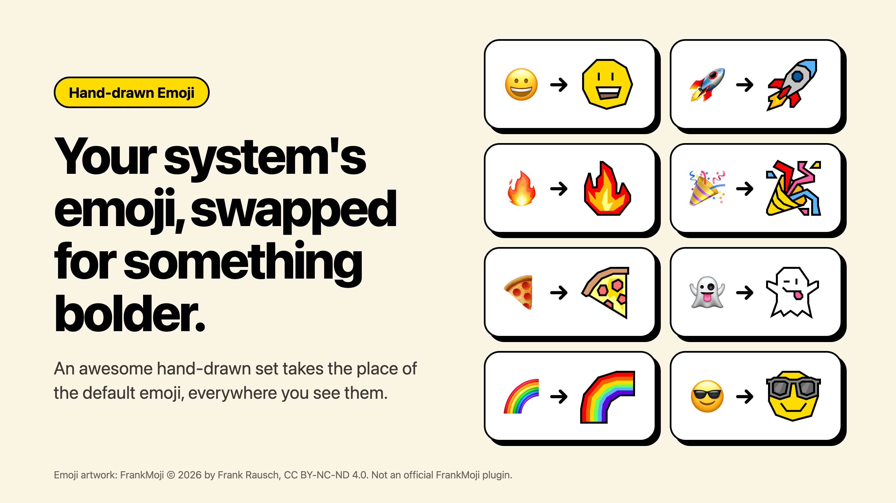

# Hand-drawn Emoji



An Obsidian plugin that replaces standard emoji with a bold, hand-drawn set. It
works in your notes (reading view, Live Preview, and source mode) and across
the rest of the app, including the file list, tabs, and search results.

Your notes are never changed. The plugin only changes how emoji are drawn, so
copy and paste, search, and screen readers still see the real emoji.

The emoji artwork is [FrankMoji](https://frankmoji.com/) © 2026 by Frank
Rausch. This is not an official FrankMoji plugin. It is an independent project
that is not made, sponsored, or endorsed by Frank Rausch. See
[License](#license) for the full credit.

## Using it

Install **Hand-drawn Emoji** from Community plugins and turn it on. That's
it.

To switch back to your system's emoji without disabling the plugin, run
**Hand-drawn Emoji: Turn on or off** from the command palette, or use the
toggle in the plugin's settings.

## Good to know

- The set has no flags or family emoji, so those stay as they are.
- A note's title at the top of the page and text you are typing into a field
  keep the system emoji. Everything else in the note uses the hand-drawn set.
- The whole emoji set ships inside the plugin. Nothing is downloaded and the
  plugin makes no network requests.

## How it works

- In rendered text, each emoji is wrapped in a span that keeps the original
  character but hides the glyph and draws the hand-drawn SVG behind it.
- In the editor, a CodeMirror extension draws a mark over each emoji instead,
  so the cursor, selection, and undo behave as usual.
- The SVGs are stored in one zip inside `main.js`. Each one is unpacked the
  first time it appears on screen.

## Development

```sh
npm install
npm run build     # packs the emoji, type checks, and writes main.js
npm test
tools/install-dev.sh "/path/to/your vault"   # build and copy into a vault
```

### Updating the emoji set

Frank asks that plugins stay current with the latest FrankMoji release, so
check https://frankmoji.com/ for a newer set before each release.

Drop the new SVGs into `emoji/` and run:

```sh
python3 tools/build-map.py
```

The script matches each SVG filename to its emoji using Unicode's
`tools/emoji-test.txt` and rewrites `src/emoji-map.json`. Grab a newer
`emoji-test.txt` from https://unicode.org/Public/emoji/latest/ when Unicode
adds emoji.

### Releasing

1. Bump the version in `manifest.json`, `package.json`, and `versions.json`.
2. Write the release notes in `release-notes/<version>.md`.
3. Commit, tag the commit with the bare version number (for example `1.0.1`),
   and push the tag. The release workflow builds the plugin and publishes the
   release with those notes.

## License

The plugin's code is MIT licensed (see `LICENSE`). `NOTICE` explains what that
license does and does not cover.

The emoji artwork in `emoji/` is [FrankMoji](https://frankmoji.com/) © 2026
Frank Rausch, licensed under
[CC BY-NC-ND 4.0](https://creativecommons.org/licenses/by-nc-nd/4.0/) (see
`emoji/LICENSE.txt`). The artwork ships unmodified and is not covered by the
MIT license. Its license does not allow commercial use or modified versions of
the artwork.

Per the [FrankMoji FAQ](https://frankmoji.com/), a plugin built on the set must
not use "FrankMoji" in its name or to advertise itself, must say that it is not
official, and must give clear attribution. Keep that in mind when editing the
manifest, the settings page, this README, or the release notes.
